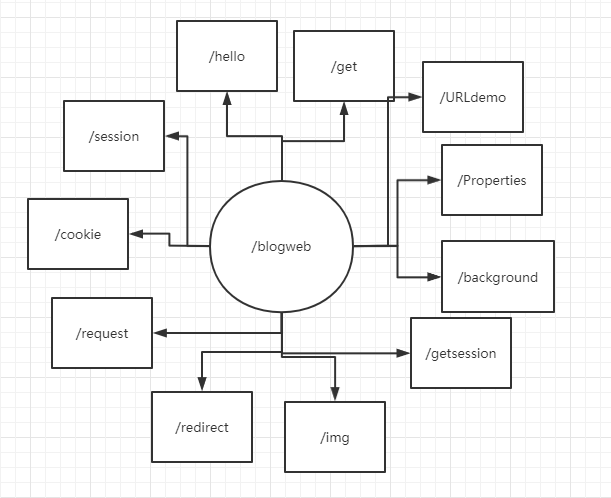

# javaweb学习配套源码
## 1、环境
+ Idea 2021.2.3
+ Tomcat 9.0.55
+ Maven 3.8.4
## 2、测试中浏览器地址栏中的URL路径
**Tomcat中设置什么路径，web.xml配置的路径前添加什么**

## 3、各类的功能在类源码中均有说明
## 4、建议配套此篇博客一起食用
## 5、此项目是配套b站狂神JavaWeb视频所作
## 6、才疏学浅，还请大佬多多指正